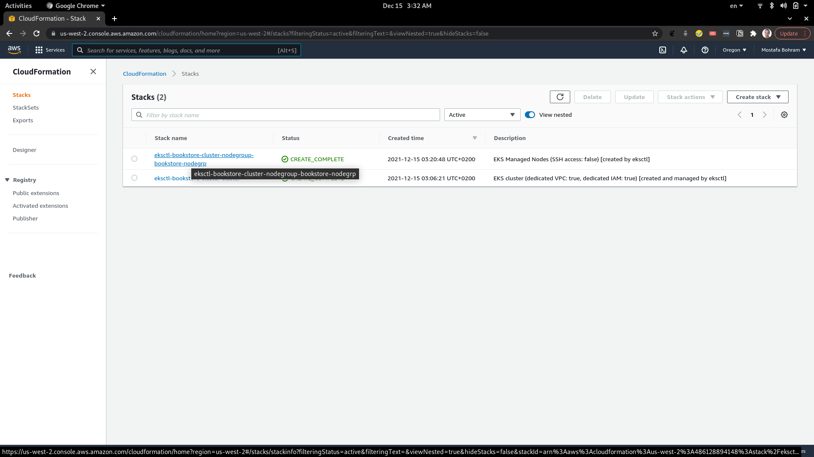
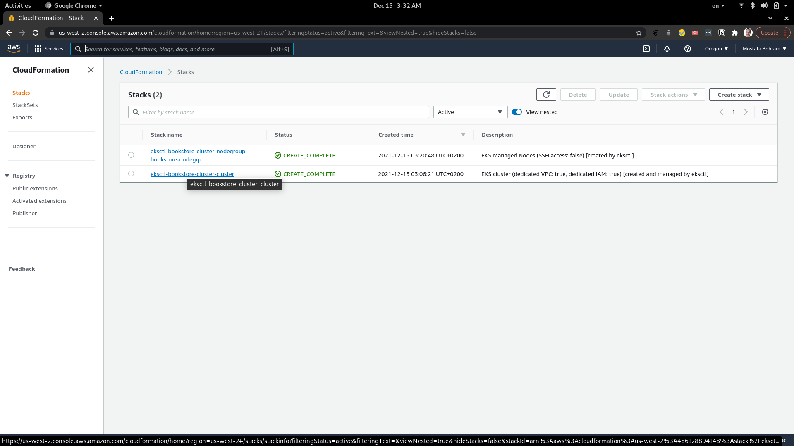
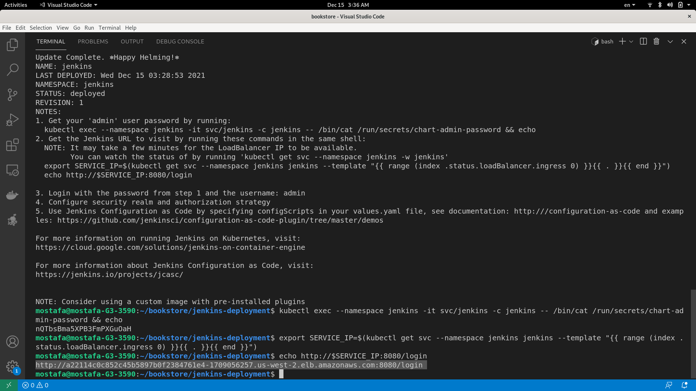
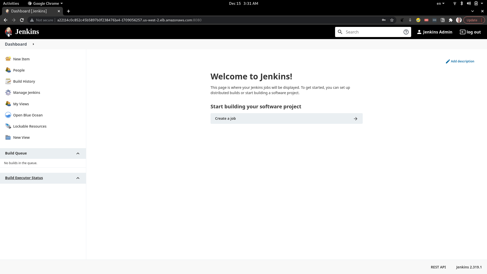
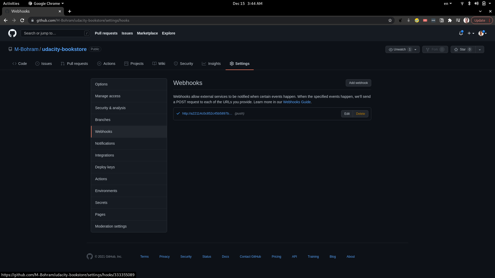
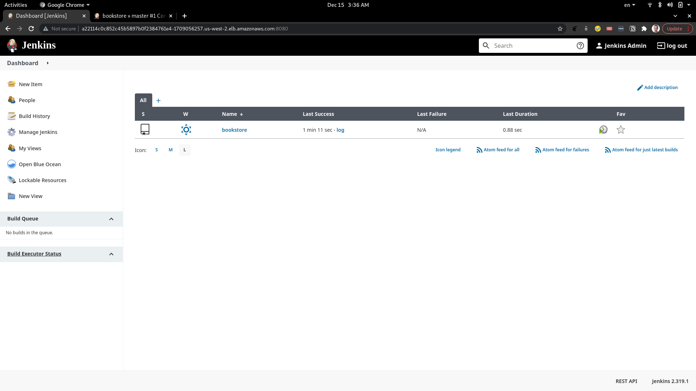
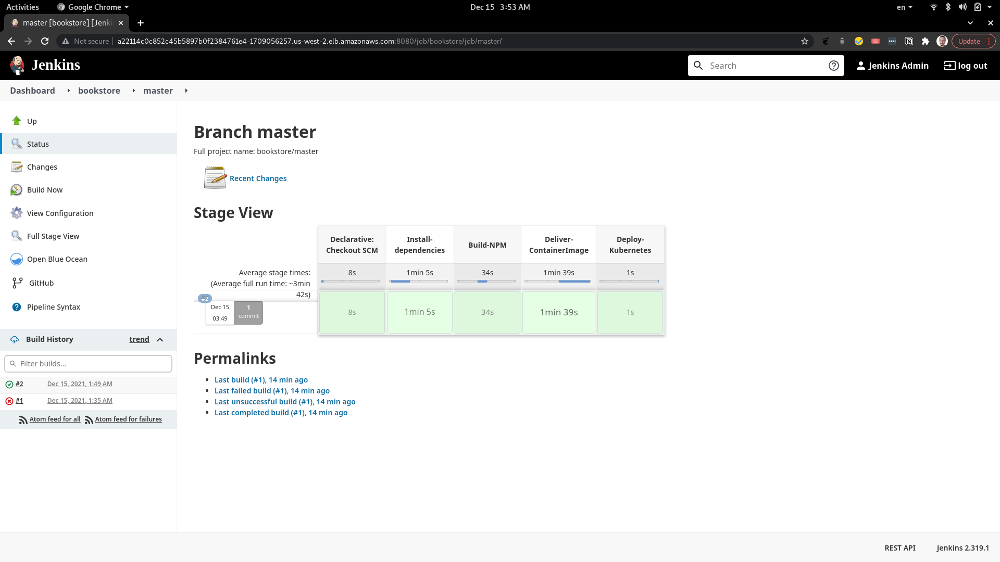
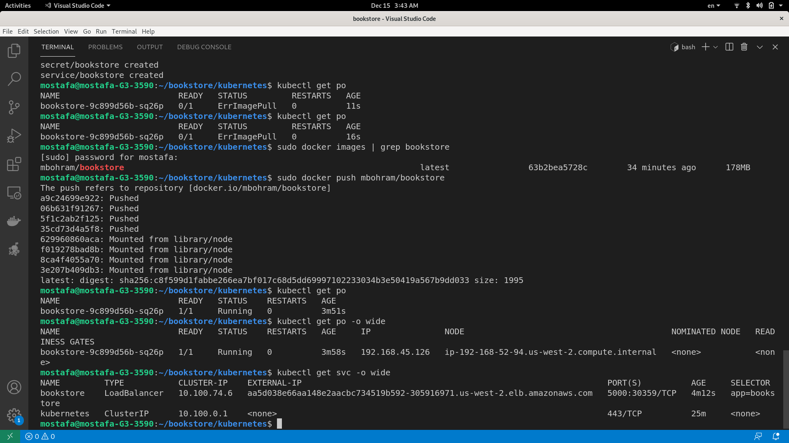
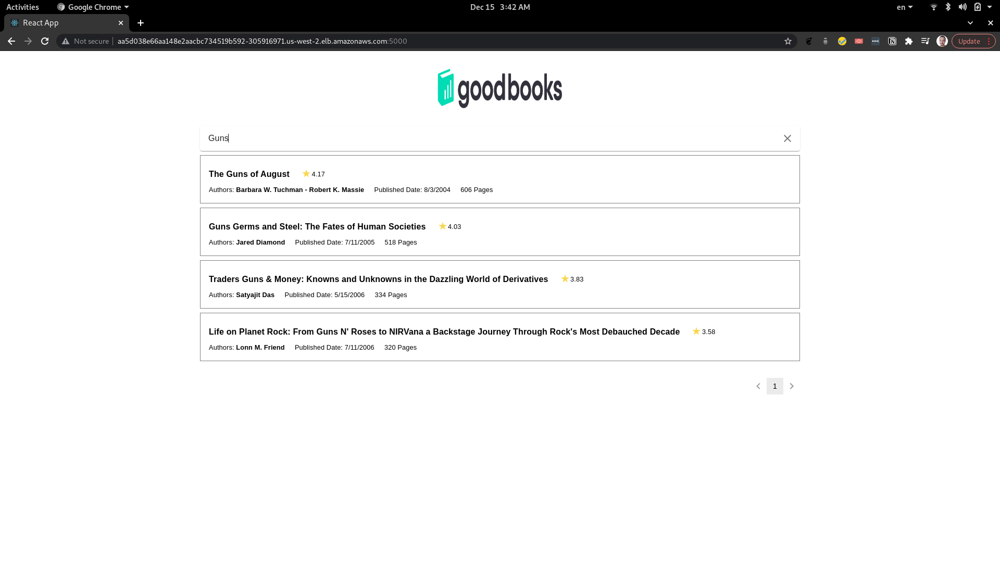

# Bookstore

## Tech Stack

- Frontend (React with Material UI)
- Backend (Nodejs and Express)
- Database (Document-based with MongoDB Atlas)
- Deployment (EKS cluster in AWS)
- CICD (Jenkins on Kubernetes)

## Local Setup

- Frontend
    1. change the directory ```cd frontend```
    2. install the dependencies ```npm install```
    3. add .env file with API_URL
    4. run the dev server ```npm start```

- Backend
    1. change the directory ```cd backend```
    2. install the dependencies ```npm install```
    3. add config.env file with ATLAS_URI
    4. run the nodemon dev server ```npm start```

You should run both of them at the same time.

## Production Setup

1. create EKS cluster from ```scripts/create-cluster.sh``` bash script.
2. deploy Jenkins with its dependencies using ```jenkins-deployment/deploy.sh```
3. create a webhook in your github repository that matches the Jenkins URL that will be generated
4. change the environment variables values in ```kubernetes/secret.yaml``` file with your own values
5. deploy the kubernetes deployments using ```kubectl create -f kubernetes/```
6. make sure that changes pushed to the GitHub repository is triggered by Jenkins and a new version of the app is deployed

P.S: The deployed app has both the frontend and backend.

## Screenshots
Deploying EKS using CloudFormation (from a CLI command) - 1


Deploying EKS using CloudFormation (from a CLI command) - 2


Deploying Jenkins using a Helm Chart


Jenkins Dashboard after logging in


Add GitHub Webhook to the Repository


Bookstore Multibranch Pipeline


Automatic trigger the pipeline using the webhook created earlier


Deploying the bookstore app and route traffic to it using a Loadbalancer service and generate the app Url


The bookstore app using the generated loadbalancer Url


